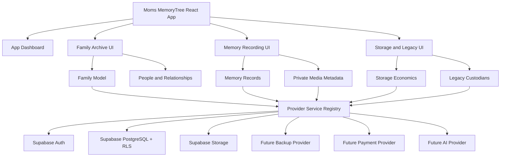

# Moms MemoryTree — App Index

> “Don't just leave your family pictures. Leave them your story.”

Moms MemoryTree is a private family memory and digital legacy app. It is built for families who want more than folders of photos: stories, voices, relationships, family context, future messages, and long-term continuity.

This page is the written GitHub index for what the app can do today, what is foundation-only, and what must be connected before production.

For the coded visual demo, open [`index.html`](index.html).

## What the app is

Moms MemoryTree is a family-centered archive with five principles:

1. The family owns the archive.
2. Memories belong to people and relationships, not just file names.
3. Private media stays private by default.
4. Legacy access is deliberate, not automatic.
5. Backup, AI, payments, and production claims are never shown until real providers are connected and verified.

## Current app dashboard

The app now opens to a dashboard that shows the operating state of the project.

### Dashboard panels

| Panel | What it shows |
|---|---|
| Foundation status | Stages 0–12 are complete before deeper dashboard work begins. |
| Provider matrix | Which capabilities run through Reaper, Supabase, or future unavailable providers. |
| Security readiness | Local guardrails, private media expectations, RLS checks, and live-test blockers. |
| Deployment blockers | Supabase environment, private bucket, signed URL function, and backup provider status. |
| Storage economics | Estimated storage usage, costs, revenue, and quota signals. |
| Operator queue | The next safe actions before production. |

## App screens

| Screen | Purpose | Current status |
|---|---|---|
| Dashboard | Project/foundation status and operator readiness. | Implemented. |
| Home | Family archive landing page and story-first entry point. | Implemented. |
| MemoryTree | Family people and relationship model. | Implemented foundation. |
| Record | Preserve a story or attach private media. | Implemented foundation with upload chain. |
| Memories | Browse family memories with privacy labels. | Implemented. |
| Family | Add people, connect relationships, prepare invites. | Implemented foundation. |
| Storage | Show usage, plan assumptions, quota warnings, and cost estimates. | Implemented foundation. |
| Timeline | Display life events in order. | Implemented. |
| Legacy | Show legacy custodians and future-access boundaries. | Implemented foundation. |
| Creator | Admin cost dashboard for storage economics. | Implemented foundation. |

## What the app can do now

### Family archive

- Create a family-centered archive model.
- Track family members, people, and relationships separately.
- Support unlimited-generation relationship modeling at the data layer.
- Show demo data safely when live provider variables are missing.

### Memories

- Create memory records.
- Classify memories by type: story, photo, video, audio, life lesson, or letter.
- Attach people, dates, locations, categories, tags, and privacy levels.
- Display memory cards with family context instead of raw file-folder views.

### Private media foundation

- Generate private storage paths.
- Validate media before preservation.
- Save the memory row before media metadata.
- Track upload status.
- Keep media object references in storage, not PostgreSQL blobs.
- Route signed access through a server-side authorization boundary.

### Privacy and security foundation

- Use family-scoped data models.
- Include Row Level Security migrations.
- Include static validation for family isolation rules.
- Keep environment files out of source control.
- Keep the public environment template placeholder-only.
- Run a secret scan during validation.

### Legacy foundation

- Model primary and backup legacy custodians.
- Mark memories as active or legacy-ready.
- Preserve the rule that custodians do not automatically receive private memories.
- Keep future legacy activation workflows separate from current access.

### Storage economics

- Track videos, photos, audio, documents, thumbnails, archives, and bandwidth separately.
- Estimate monthly provider costs from assumptions.
- Estimate subscription revenue separately from infrastructure cost.
- Show quota usage and warnings.
- Keep backup and archive export claims honest until real jobs exist.

### Deployment readiness

- Include Supabase migrations.
- Include private bucket architecture.
- Include signed media access Edge Function source.
- Include deployment validation scripts.
- Include a GitHub Actions workflow for deployment when credentials are configured.
- Clearly separate local validation from live production deployment.

## What is intentionally not claimed yet

These are designed or scaffolded, but not production-live:

- Live Supabase deployment from this environment.
- Live cloud upload and playback verification.
- Independent backup provider.
- Scheduled backup jobs.
- Restore verification.
- Archive export worker and downloadable bundle.
- Payment processing.
- Notifications.
- AI transcription, summaries, tags, or search.
- Production launch.

## Architecture map



## Validation commands

Run the full local safety gate before trusting changes:

```bash
npm install
npm run validate
```

The validation pipeline covers:

- linting
- tests
- database migration checks
- RLS/static family isolation checks
- environment checks
- live-harness safety checks
- deployment automation checks
- secret scanning
- production build

## Local development

```bash
npm install
cp .env.example .env.local
npm run dev
```

Without live provider variables, the app starts in safe demo mode.

For Supabase-backed development, configure only local environment values. Never commit credentials.

## Production-readiness boundary

Moms MemoryTree is ready for dashboard and product UI iteration. It is not yet a production launch until live provider setup and verification are complete.

Before production, the project still needs:

1. Live Supabase environment configuration.
2. Database migrations applied to the live project.
3. Private storage buckets created and verified.
4. Signed media function deployed and tested.
5. Real Family A / Family B isolation tests.
6. Backup provider selected, configured, run, and restore-tested.
7. Production monitoring and incident procedures.
8. External security review.

## Repo source of truth

The repository owns:

- app code
- domain types
- provider abstractions
- migrations
- validation scripts
- security and deployment docs
- foundation stage handoff docs

Private family media, private user data, and credentials do not belong in GitHub.
